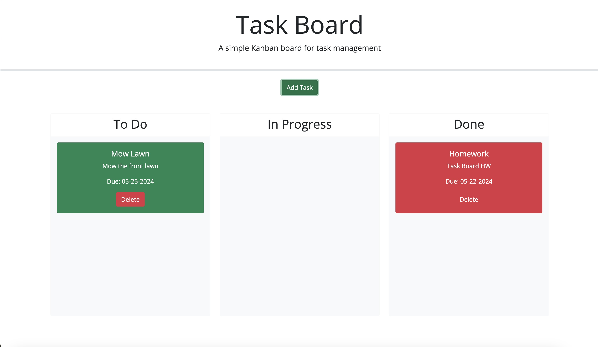

# task_board

## Description 
A simple task board application that allows a team to manage project tasks by modifying starter code.

## Technologies
HTML, CSS, JavaScript, Bootstrap, JQuery

## Repository
https://github.com/Jlvstrasse/task_board

## Usage
Click on 'Add Task', then enter your task title, due date, and description. Once you click 'Add Task' again, a card will appear in the To Do section. This task can then be dragged to either 'In Progress' or 'Done'. There is also a delete button incase the task needs to be deleted. Each task is color coded based on the due date.

## License
MIT License

## Deployed Application
https://jlvstrasse.github.io/task_board/